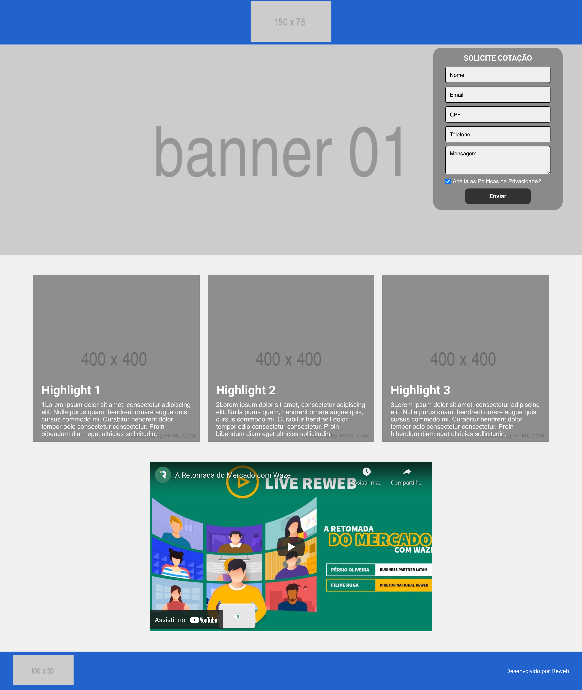

# Reweb - Desenvolvedor Front-end

O objetivo deste desafio é avaliar as competências técnicas dos candidatos à desenvolvedor Front-end na Reweb. A tarefa consiste no desenvolvimento de uma página que utilize elementos [AMP](https://amp.dev/).

# ✅ Requisitos técnicos

- [Node.js](https://nodejs.org/en/)
- [Gulp](https://gulpjs.com/)
- [Yarn](https://yarnpkg.com/en/)
- [Twig](https://twig.symfony.com/)
- [BEM](http://getbem.com/)
- [SASS](https://sass-lang.com/)
- [AMP](https://amp.dev/)

# 📝 Estrutura do template

O template do desafio encontra-se no diretório `themes/template-01` (alterar somente os arquivos nesse diretório), consiste na seguinte estrutura:

```html
- assets
-- css
--- sass
-- img
- pages
- source
-- output
```

# 🔥 Executar projeto 

Para executar o projeto, deve seguir as instalações conforme os requisitos técnicos.

Instalando as dependências do projeto

```bash
yarn install
```

Executar o projeto

```bash
gulp
```

# 💪 Desafio 

Segue abaixo as tarefas a serem realizadas:

- Recrie a página do mockup utilizando componentes AMP como amp-img, amp-youtube, amp-carousel, amp-form.
- Utilize o SASS para realizar a estilização da página.
- Aplique o padrão de projeto BEM.
- Consuma as informações do arquivo json com Twig. Sinta-se a vontade para criar mais variáveis no arquivo para melhor desempenho da aplicação.
- Utilize o Twig para listar os destaques (ver /source/index.json).

# 📷 Mockup do desafio



# ✌️ Instruções de entrega

- Crie um fork do repositório no seu GitHub
- Faça o push do código desenvolvido no seu Github
- Informe ao recrutador quando concluir o desafio junto com o link do repositório
